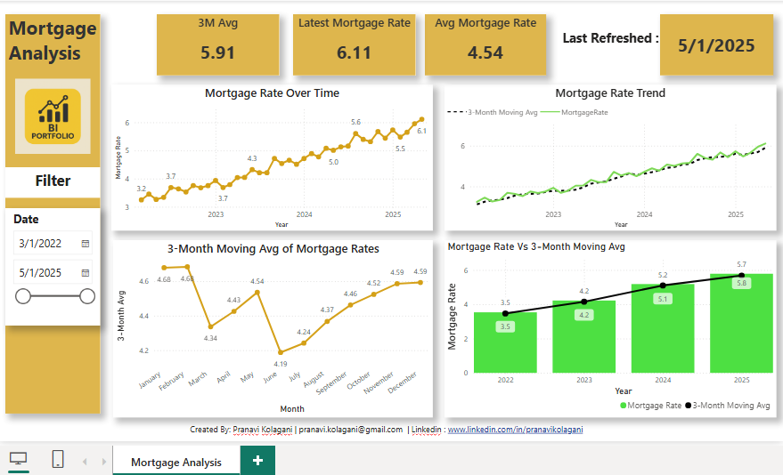

# 📊 Mortgage Rate Analysis Dashboard (Power BI)



## 📌 Project Overview

This project presents an interactive **Mortgage Rate Analysis Dashboard** developed in **Power BI**, designed to track and analyze mortgage interest rate trends over time. The dashboard uses simulated data (2022–2025) and includes KPI insights, visual comparisons, and trend identification techniques to help users separate signal from noise.

---

## 🎯 Objective

- Visualize mortgage interest rate trends and averages
- Highlight latest mortgage rate values and moving averages
- Compare actual rates vs. 3-month moving averages to seperate signal from noise
- Build a clean, professional BI portfolio project for financial analytics

---

## 📈 Key Features

- **KPI Cards**:  
  - Latest Mortgage Rate  
  - 3-Month Moving Average  
  - Average Mortgage Rate (All Time)  

- **Trend Charts**:  
  - Mortgage Rate Over Time  
  - 3-Month Moving Average Breakdown  
  - Combined Chart: Mortgage Rate vs. 3M Moving Avg  

- **Date Slicer**:  
  Allows users to filter analysis between March 2022 and May 2025

- **Dynamic Refresh Info**:  
  Last data refresh date shown for up-to-date analysis

---

## 🛠️ Tools & Technologies

- **Power BI Desktop**
- **DAX (Data Analysis Expressions)**
- **Excel** – Used for initial dataset preparation

---

## 📂 File Structure

```bash
.
├── Mortagage_Analysis_Dashboard.png   # Snapshot of the final dashboard
├── Mortgage_Rate_Trend_2022_2025.xlsx # Sample data ( included here )
├── README.md                          # Project overview and setup guide
